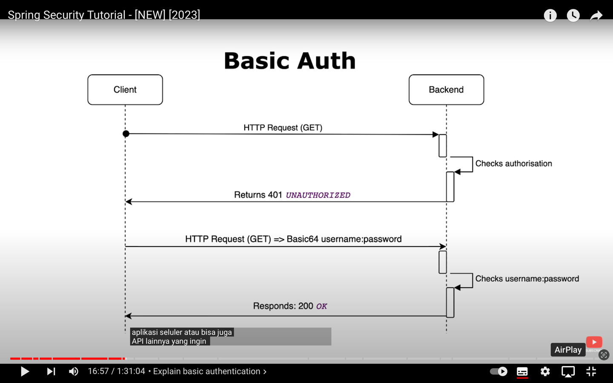
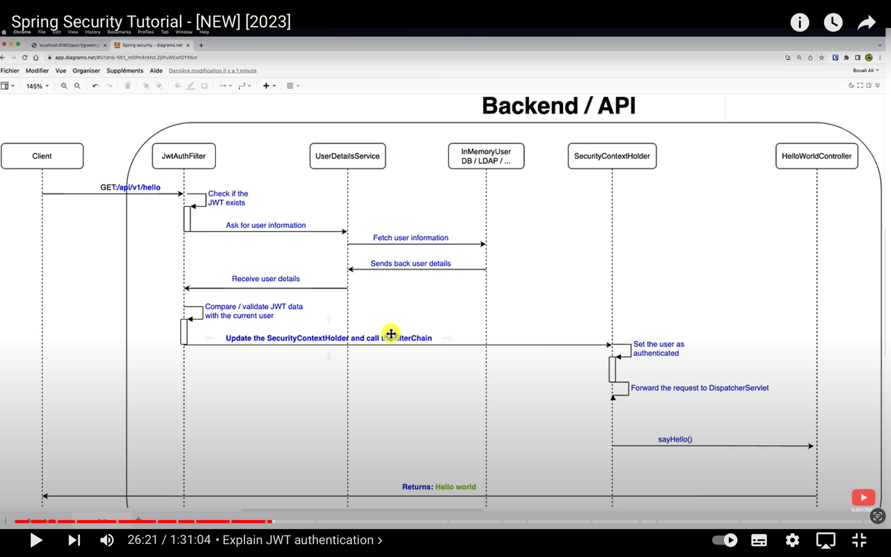

# Spring security

1. create API
2. Add Dependecy spring Security
```
    <dependency>
       <groupId>org.springframework.boot</groupId>
       <artifactId>spring-boot-starter-security</artifactId>
   </dependency>
   ```
3. Security Config
   - implement basic auth
   
4. arsitektur JWT di web service

